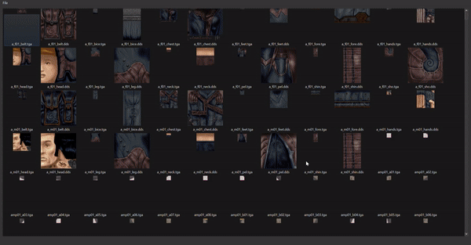
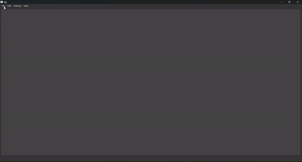
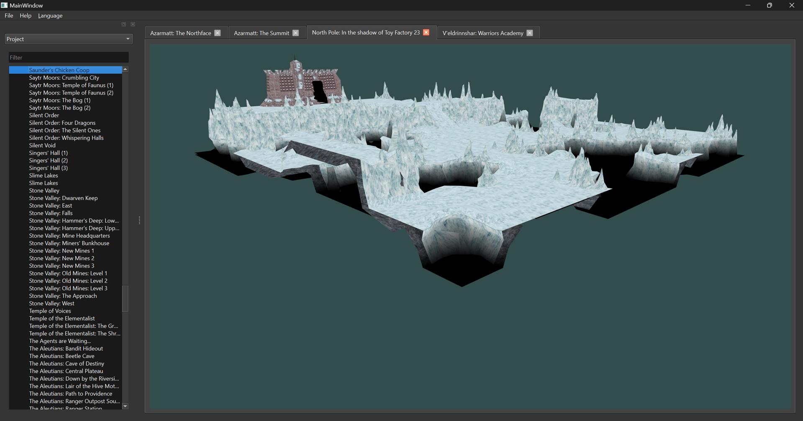
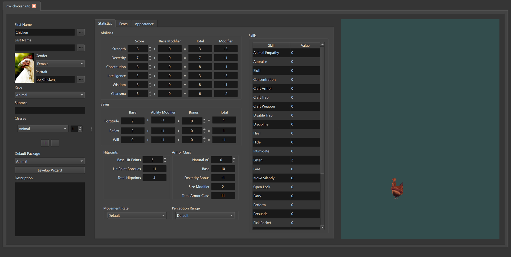
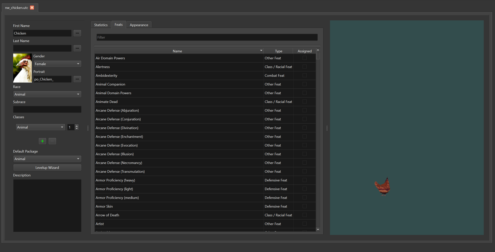
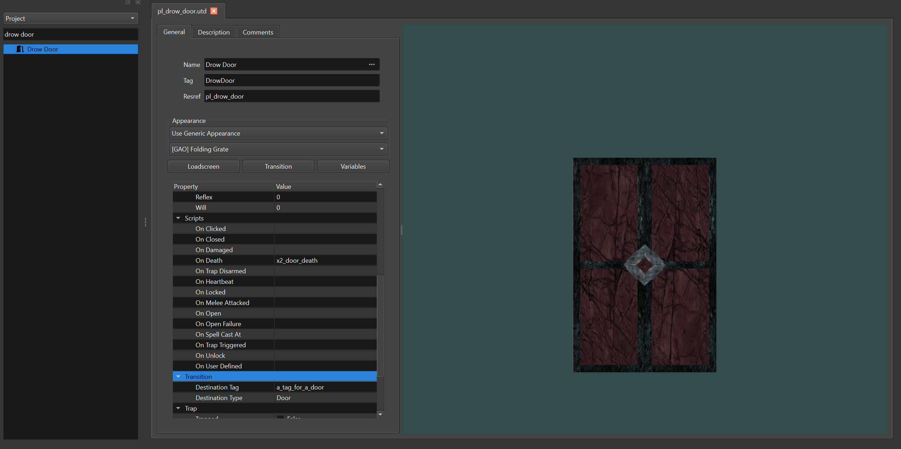
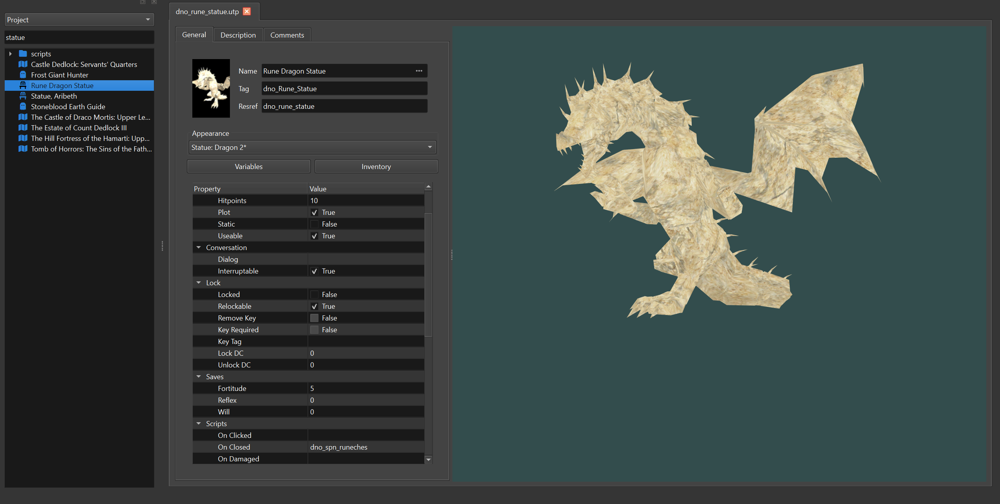
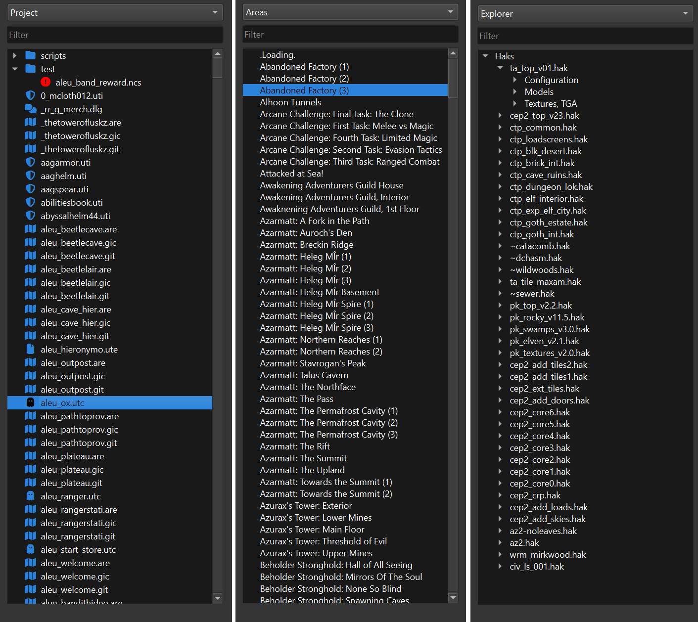

# Arclight Tools

Tools subproject of something referred to as Arclight

**This is beta software, please, keep backups.**

### Platforms

- Linux: The latest LTS of Ubuntu, roughly
- macOS: macOS Monterey and above.  Need to set up code signing.
- Windows: Windows 10 and above, Visual Studio 2019 seems to be the latest Qt supported version

## The Tools

Even though the utlimate goal of this project is something tooset-ish.  There will be some tools added
that are usefully independently of a toolset context.  They

### erfherder
**status:** beta

erfherder is an editor for [BioWare's ERF File Format](docs/bioware_aurora_engine_file_formats/Bioware_Aurora_ERF_Format.pdf).  It's features include:

* Everything in nwhak.exe
* Drag and Drop support.
* Very simple, but effective Fuzzy Search filtering.

### texview
**status:** beta

A super mid and basic texture gallery viewer for Bioware DDS, Standard DDS, TGA, and PLT texures.  It can open Key, Erf, and Zip containers.  Screenshot is using NWN:EE main key file circa 36-2.

### dlg
**status:** alpha

An editor for DLG conversation files and rollnw DLG json files.  A project of this level of complexity requires a fair bit of polish.. It has most toolset features, the main missing things is:

* Since it exists outside of a module.. completion on module scripts and journal integration.
* Inserting action strings (and corresponding highlights)
* Loading a TLK file and handling dialog nodes with string references.

-----------------------------------------------------------------------------

## The Renderer

Currently the built in renderer only supports the most basic models.  It uses OpenGL 3.3
just as NWN:EE does.  Ultimately, the goal is to replace this with a more advanced graphics
API like [DiligentEngine](https://github.com/DiligentGraphics/DiligentEngine)

Features:
* Basic Meshses
* Skin Meshes
* Un-lerped Animations
* Very basic area viewing

-----------------------------------------------------------------------------

## The Widgets

### Area View

A view for NWN areas. *Extremely* basic, but a start.

Camera Controls:
* WASD for movement.
* Up and Down arrow for height.
* Ctrl+Up and Ctrl+Down for pitch.
* Right and Left arrow for yaw.

### Container View

A view of NWN containers.  See erfheder above.

### Creature View - Stats

To those familiar, this is essentially a copy of axs' modified toolset layout.  Expanded
class selection to 8 classes as NWN:EE allows.

### Creature View - Feats

Feat selection with handy fuzzy searching.

### Dialog View

A tree view for NWN dialogs.  See dlg above.

### Door View

A widget for doors

### Placeable View

A widget for placeables

## The Views

These are widgets that present different aspects of a module.  There is still a lot of work
and investigation to be done here.

### The Project View

The project view is a filesystem view of the module.  This could be a flat single directory
like the NWN Toolsets "temp.0" folder.  Or it can be arbitrary, an error indicator is shown
if a file is shadowed by another, since in the end there is only the flat namespace of ERF
files.  This view might not be better than palette views or maybe in addition to them at
some point.

### The Area List View

This is the list of areas, similar to the NWN Toolset.  I don't see Dialogs as being particularly
special, and scripts have far far better external editors today than could ever be built internally,
there's no reason for a special scripts tree node.

### The Explorer View

This will be a view of the modules external dependencies presented very much as NWN explorer does.
Currently it only shows the modules HAK files.

## Acknowledgements, Credits, & Inspirations

- [BioWare](https://bioware.com), [Beamdog](https://beamdog.com) - The game itself
- [Qt](https://www.qt.io) - Gui
- [neveredit](https://github.com/sumpfork/neveredit) - Inspiration
- [NWNExplorer](https://github.com/virusman/nwnexplorer) - Inspiration
- [NWN Java 3d Model Viewer](https://neverwintervault.org/project/nwn1/other/nwn-java-3d-model-viewer) - Inspiration
